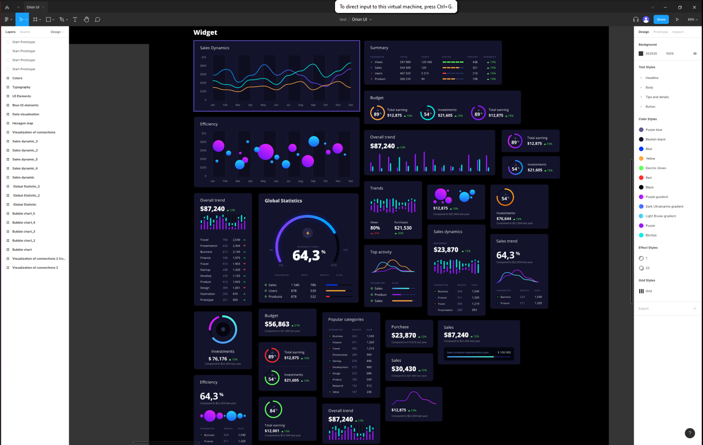

# readme

this an application that copy from [figma-linux](https://github.com/Figma-Linux/figma-linux.git)

I always interest in this UI design tool, and I decided to learn its source code by build a same project bit by bit
every day.

I have tried to run it, and it looks like this:

ok, I find out figma-linux is just an electron application that wrap figma office web. so there is limit thing I can
learn.

but I find another application called [skeditor](https://github.com/skeditor/skeditor.git), I read its code for a while
and understand a bit, just the basic. It used skia's wasm bling library called canvaskit-wasm, it allows you to draw
thing in canvas more effective than original.
